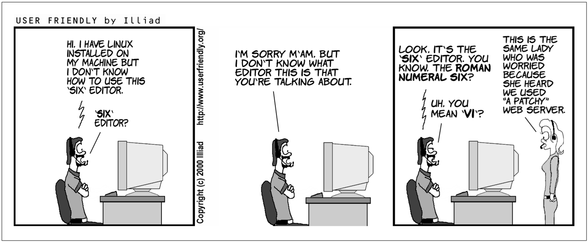

# VI tutorial

## Some preliminaries  
You can use `vi` to edit any text file. `vi` copies the file to be edited into a buffer, 
displays the buffer, and lets you add, delete, and change text. When you save your edtis, vi copies the edited buffer back into a file, replacing the old file of the same name.

---

## Minimal vi 
### Opening a file  
Type `vi [filename]` to open an existing or a new file.  Notice the tildes at the left side, which indicates empty lines and the name and status of the file on the last line (called the prompt line or the status line).  

### Two faces of vi  
**Improtant!**  
When you open a file, you start out in the *command* mode, one of the two modes in which vi operates (the other being the *insert* mode).   In the command mode every keystroke represents a command, rather than a text that you try to type. To switch to the *insert* mode, you use `i`, `I`, `a`, `A` etc. commands. To get back to the command mode, you use the `ESC` key.

### Basic editing
After you entered the editing mode, you can move by using arrow keys, delete pre-existing text with the `delete` key, and type your new text as in any other editor (but note that you can't use the mouse in non-GUI versions of vi). To switch back to the command mode, use the `ESC` key. 

### To save and quit a file  
Use `ZZ` command to save edits and quit (note that ZZ is capitalized; vi commands are case sensitive). However, it is very common in `vi` to use commands from another editor, called `ex` (in fact, vi is the visual for that editor!). To save and quit a file using the `ex` command, you type `:wq` or `:x`. You type `:q!` to exit the editor without saving the file.

**Congratulations! You can now edit in vi!**

---

## Intermediate vi
There are many additional vi command, which will make your editing much more efficient.  Here are some that I found useful:

### Simple edits 
`i` to insert text before the cursor (`I` at the beginning of the line)  
`a` to add text after the cursor (`A` at the end of the line)  
`d` to delete  

- `dw` to delete a word  
- `dd` deletes a line  
- `dl` or `x` deletes one character  
- `D` deletes from the cursor position to the end of the line  

`r` will replace a single character (without switching to the editing mode)  
`~` will replace the case of the letter

You can also use `cw`, `cc`, `C` to change a word, line, or the rest of the line and `s` to substitute character at cursor (`S` will substitute a line).  

**Important!**  
For most of these commands, you can add an integer in front to execute them multiple times. _E.g._, `2dd` will delete two lines, `2cb` will change back two words, and `20i hi, there! `+`ESC` will insert that phrase 20 times.

Finally, `.` will repeat the previous command and `u` will undo the last change. 	

### Complex movements 

There are vi commands to scroll forward and backward through the file by full and half screens: `^F`, `^D`,`^B`, and `U`, respectively, where `^` stands for the `CTRL` key. 

On the screen itself, you can move to the top line, middle line, and last line with `H`, `M`, and `L`.

Use `0`/`^` and `$` to move to the beginning and end of a line.

Use `#G` to go to a specific (#) line of your file. `G` without a line number moves the cursor to the last line of the file.  Typing two backquotes returns you to your original position. BTW, to see numbers in vi type `:set nu` or `:set number` (`:set nu!` or `:set nonumber` to remove them).

Obviously, there are commands for "simple movements" as well, but I find them less useful.  In any case, keys `h`, `j`, `k`, and `l` move your cursor left, down, up, and right, respectively, while `e` and `b` move it to the beginning/end of a word.

### Cutting, copying, and pasting.

**Congratulations! You can be very efficient in vi now! But there is more...**

---

## Advanced vi
Here we will talk about some advanced features that reveal the real power of vi.

### Ex editor 

You have used some of the ex commands already (`:x`, `:wq`, _etc._). In fact, every time we type a colon in **vi** we invoke an ex command. Technically, **ex** is a line editor and **vi** is its visual mode.  You can try to use **ex** by itself in unix, but it can be tricky. The thing to remember is that **ex** deals with lines, so its basic commands `d`, `m`, `co` will delete, move, and copy a line.  The power of **ex** comes from its ability to deal with multiple lines at the same time. 

#### Three ways to access lines in ex:

## VIM (Vi IMproved)
