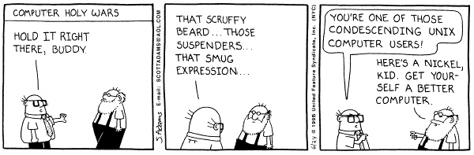

# Introduction to UNIX

## UNIX 

The objective of this tutorial is to introduce you to [UNIX](https://en.wikipedia.org/wiki/Unix). Although UNIX's  [Command-Line Interface](https://en.wikipedia.org/wiki/Command-line_interface) may seem archaic, it is the single most powerful tool in a bioinformaticians toolbox. Some basic understanding of how to use the Command Line to move, modify and view files containing molecular and descriptive data is an absolute requirement for modern biological analysis.

## A few definitions:
**UNIX:** A computer operating system originally developed in 1969 by a group of AT&T employees at Bell Labs. Unix was designed to be portable, multi-tasking and multi-user in a time-sharing configuration. Unix systems are characterized by various concepts: the use of plain text for storing data; a hierarchical file system; treating devices and certain types of inter-process communication (IPC) as files; and the use of a large number of small programs instead of a single monolithic program that includes all of the same functionality. These concepts are known as the Unix philosophy.

**Terminal:**  A device, including a keyboard and a screen (or printer), used to send data to and receive data from a computer.

**Terminal.app:** is a terminal emulator included in Apple's Mac OS X operating system. It allows the user to interact with the computer through a command line interface. On Mac OS X, Terminal is located in the /Applications/Utilities folder. You can personalize the appearance of the terminal window using the Terminal -> Preferences menu option.

**Shell:**  A program that allows the system (UNIX) to understand your commands. There are three main uses for the shell: interactive use (reading input from your terminal and sending output to it); customization of your UNIX session; programming. Several shells [are available](http://www.faqs.org/faqs/unix-faq/shell/shell-differences/) in UNIX. We will be using the [Bourne again shell](https://en.wikipedia.org/wiki/Bash_(Unix_shell)) (bash).

## I) Ten basic commands:

We will start by reviewing ten essential UNIX commands that allow you to operate on files in any UNIX system (_note, there is nothing magical in the number ten, just seems like a nice number to me!_):

`pwd`, `ls`, `cd`, `cp`, `mv`, `mkdir`, `rm`, `man`, `cat/zcat`, `echo`.  

There are also five symbols (wildcards and shell expansion characters) that we often use with these commands:

`/`, `~`, `.`, `..`, `*`

To make sure that we are all on the same page, predict the action of the following commands and check your predictions by typing them in the terminal:

`cd`;  
`pwd`;  
`ls -tl`;  
`mkdir -p eeob563/lab1`;  
`cd eeob563/lab1`;  
`mkdir temp1 temp2 temp3`;  
`mv temp1 temp2 temp3`;  
`rm -rf temp*`;  
`cd ..`;  
`cd -`;  
`pwd`;   

Note, that if all this is new to you, you may need to start with a [more basic tutorial](http://www.ee.surrey.ac.uk/Teaching/Unix/).

> ### Useful shell features
> There are two extremely useful features provided by most shells.  
> 
> **First**, if you hit the tab key after you started typing any of them, the shell will try to fill in the rest for you! For example, enter:  
> `ls <tab>`  
> The shell will fill in the rest of the filename!  
> Similarly, enter:  
> `c<tab><tab>`  
> You will see the name of every program you can run that starts with an c. One of those is `cat`. Now, `cat` is easy to type, but there may be other commands with longer names (_e.g._, `fastx_nucleotide_distribution_graph.sh`)!
>
>**Second**, most shells will keep a history of recent commands! To access this history use your up and down errors. The up arrow takes you backwards through your command history. The down arrow takes your forwards in the command history. You can also enter 'history' to see all the history commands.

## Ten additional commands

Here are ten additional commands that will come in handy:
`head`, `tail`, `less`, `wc`, `grep`, `chmod`, `tar`, `gzip`, `top`, `kill`.  

What do these commands do?  
Check their manuals and/or discuss with your classmates!

## III) Input/Output (I/O) redirection and shell metacharacters:

The shell and many UNIX commands take their input from standard input (stdin), write output to standard output (stdout), and write error output to standard error (stderr). By default, standard input is connected to the terminal keyboard and standard output and error to the terminal screen. However, each of these "streams" can be redirected using a redirection metacharacter followed by the desired destination.

Metacharacters are special characters in entered as part of a Unix command that the shell interprets rather than passes to the command. Here is a list of most of them. 

| Symbol | Meaning            | Explanation/Example |
| :---:  | ---                | ---                 |
| >	      | Output redirection | redirect the output from a program |
| >>     | Output redirection (append) | echo "Hi again" >> file    |
| 2>	  | Standard error redirection |	redirect error messages |
| <      | Input redirection	        | say < file |
| *      | wildcard for zero or more characters | ls -l *.txt |
| ?      | File substitution wildcard; one character | ls -l ???_data.txt |
| [ ]	  | File substitution wildcard; any character between brackets||
| \`cmd\` | Command Substitution | ls -l \`which less\` |
| $(cmd) | Command Substitution | ls -l $(which less) |
| \|    | The Pipe (\|)	use output of one command as input for another | cat <file> \| wc |
| &     | Run command in the background |             |

## IV) VI (visual editor)

`vi` is a screen-oriented (rather than teleprinter-oriented :) text editor originally created for the Unix operating system. While there are several other editors available in Unix, `vi` is the default editor for many UNIX programs, including git.

### Opening a file  
Type `vi [filename]` to open an existing or a new file.  Notice the tildes at the left side, which indicates empty lines and the name and status of the file on the last line (called the prompt line or the status line).  

### Two faces of vi  
**Improtant!**  
When you open a file, you start out in the *command* mode, one of the two modes in which vi operates (the other being the *insert* mode).   In the command mode every keystroke represents a command, rather than a text that you try to type. To switch to the *insert* mode, you use `i`, `I`, `a`, `A` etc. commands. To get back to the command mode, you use the `ESC` key.

### Basic editing
After you entered the editing mode, you can move by using arrow keys, delete pre-existing text with the `delete` key, and type your new text as in any other editor (but note that you can't use the mouse in non-GUI versions of vi). To switch back to the command mode, use the `ESC` key. 

### To save and quit a file  
Use `ZZ` command to save edits and quit (note that ZZ is capitalized; vi commands are case sensitive). However, it is very common in `vi` to use commands from another editor, called `ex` (in fact, vi is the visual for that editor!). To save and quit a file using the `ex` command, you type `:wq` or `:x`. You type `:q!` to exit the editor without saving the file.

There is much-much more you can do with `vi`. Here is a short [tutorial](.

## V) A short tutorial to play with Unix commands:

1) Go to your home directory on HPC-class and check its content;

2) In your home directory create a new directory called EEOB563\_labs;

3) Create a directory called lab1 within EEOB563_labs;

4) Use cal, one of several neat, small, “miscellaneous” commands available in UNIX to create a calendar for the month and the year of your birth and save it to a file called calendar.txt;  

5) How can you see the content of that file?

5) How many lines/words/characters does it have?

6) Rename this file into my_birthmonth.txt

7) Make a copy of this file 

8) Now remove this duplicated file

> Warning:  be careful when removing files!  It is very easy to remove all your files at the same time and there is no way to recover them.  Please read the manual (man rm) before you use it.

If you are interested to learn more about UNIX, check out [this tutorial](https://www.hpc.iastate.edu/guides/unix-introduction) provided by the HPC teach on campus.