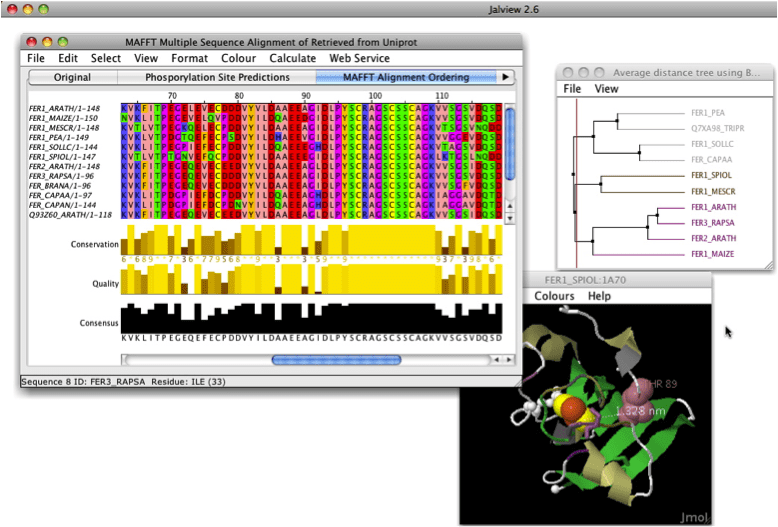

# MAFFT Tutorial

Multiple Sequence Alignment (MSA) is generally the alignment of three or more biological sequences (protein or nucleic acid) of similar length. From the output, homology can be inferred and the evolutionary relationships between the sequences studied. While there are multiple [tools](https://www.ebi.ac.uk/Tools/msa/) for MSA, we will use MAFFT for this exercise.

[**MAFFT**](https://mafft.cbrc.jp/alignment/software/) (for Multiple Alignment using Fast Fourier Transform)
is a multiple sequence alignment program for unix-like operating systems.
The first version of MAFFT
used an algorithm based on progressive alignment, in which the sequences were clustered with the help of the Fast Fourier Transform (hence the name).
You can read more about limits and limitations of `mafft` [here](https://mafft.cbrc.jp/alignment/software/about.html)

### mafft on Nova
MAFFT is already installed on Nova as one of the modules. You can load it with `module load mafft`.
(To see all the version of mafft in modules use `module -r spider "mafft"`

### mafft --auto

The simplest way to run mafft is by using the `--auto` option:  
`mafft --auto <filename.fa> > <alignment.fa>`, where `filename.fa` is the name of a file of molecular
sequences in FASTA format and `alignment.fa` is the name of the output file.

### Additional useful options
#### Input

* `--nuc` Assume the sequences are nucleotide. Default: auto
* `--amino` Assume the sequences are amino acid. Default: auto

#### Output

* `--clustalout` and `--phylipout` Output format: clustal format. Default: off (fasta format)  
* `--inputorder` Output order: same as input. Default: on
* `--reorder` Output order: aligned. Default: off (inputorder)
* `--treeout`Guide tree is output to the input.tree file. Default: off

#### Direction of nucleotide sequences
Two options generate reverse complement sequences, as necessary, and align them together with the remaining sequences.  
`mafft --adjustdirection input > output` is based on 6 mer counting and faster;  
`mafft --adjustdirectionaccurately input > output` is based on DP and slower.

## DATA
1. We will use a set of cytochorome b aa sequences for this exercise. The sequences are
in the `computer_labs/lab1` directory of the class repository. If you still have problems with the GitHub, you can
download sequences directly into your directory using the following unix command:
`wget https://raw.githubusercontent.com/ISU-MolPhyl/EEOB563-Spring2021/master/computer_labs/lab2/cob_aa.fasta`
2. Align these sequences using mafft and save them in fasta format.
3. To use this alignment in PAUP next week, we'll need to convert it into the Nexus format.
4. Read brief Wikipedia descriptions of [FASTA](https://en.wikipedia.org/wiki/FASTA_format)
and [Nexus](https://en.wikipedia.org/wiki/Nexus_file) file formats.

## Visualizing the Alignment (optional)
There are several ways to visualize an alignment.
We will consider two:
- [SeaView](https://doua.prabi.fr/software/seaview) is a multiplatform, graphical user interface for multiple sequence alignment and molecular phylogeny.  
- [Jalview](https://www.jalview.org/) is is a free cross-platform program for multiple sequence alignment editing, visualisation and analysis. It can be used to align, view and edit sequence alignments, analyze them with phylogenetic trees and principal components analysis (PCA) plots and explore molecular structures and annotation.

## Cleaning the alignment (optional)
When you visualize your alignment, you may observe that some of it's regions are poorly conserved and/or have many gaps.
Although, this practice is somewhat controversial, many researchers would remove such regions.
There are two programs you can use to do this, but I recommend two:
- [Gblocks](http://www.phylogeny.fr/one_task.cgi?task_type=gblocks) is a computer program written in ANSI C language that eliminates poorly aligned positions and divergent regions of an alignment of DNA or protein sequences.
- [TrimAl](https://github.com/inab/trimal) is a tool for the automated removal of spurious sequences or poorly aligned regions from a multiple sequence alignment.

## Additional Tools
[T-coffee](https://tcoffee.crg.eu/apps/tcoffee/index.html) can be used to run+combine and/or compare several alignment algorithms.  
