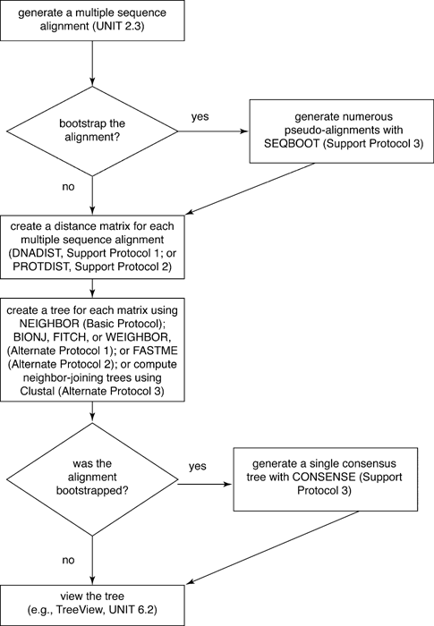
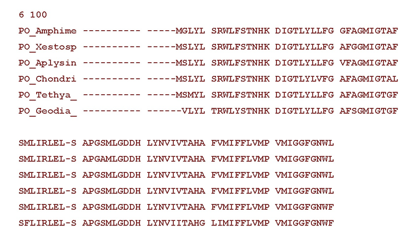

# Lab #3 (PAUP, PHYLIP, and FASTME)

## General considerations

It is important to keep in mind that there are two distinct steps in 
any distance analysis so we'll have to make two sets of choices:  

1. Calculate/estimate all pairwise distances  
  	- We usually use an explicit (and often quite complex) model for DNA sequence evolution  
  	- We don't know yet how to select "the best" model  
1. Estimate a tree from the distance matrix  
  	- Can use distances as an optimality criterion (ME, LSS)  
  	- Can use distances in a clustering algorithm (UPGMA, NJ)

In some programs (like PHYLIP), these two steps are explicit. In other programs they may be less obvious.  _But they are always there!_

## Part1: PAUP

### Align and load the data (cob_nt.fa)
We already know how to align sequeces and import them in PAUP so this part should be easy :).

### Select a model for distance calculation
Specify a distance correction we want to use by using the `dset` command.  We will be using uncorrected (“p”), Jukes-Cantor, Kimura 2-parameter, HKY85, and GTR distances. 

### Examine the distances
Use `showdist` command to see the distance table.

### Use distances as an optimality criterion
`set criterion=distance;`  
`dset objective=me dist=jc;`    
`hsearch;`

> - What distance and what optimality criterion did we use?
> - Now evaluate the tree using the Fitch-Margoliash weighted least-squares criterion (inverse squared weighting) and GTR distances.

### Run the neighbor-joining algorithm with the selected distance
Can you figure out what is the command name for the neighbor-joining analysis?
How about UPGMA?

Run neighbor-joining search with 5 distances listed above.

> - How does the distance model chosen affect the tree found by NJ for this data set?  
> - Can you figure out how to perform a bootstrap analysis (100 replicates, heuristic search using least squares) under the HKY85 model?  
> - Write a PAUP block that will do several distance analyses automatically for you.

## Part2: PHYLIP

[PHYLIP](http://evolution.genetics.washington.edu/phylip.html) is a package of phylogenetic programs written by [Joe Felsenstein](http://evolution.gs.washington.edu/felsenstein.html) group and first released in 1980. 
The programs can infer phylogenies by parsimony, compatibility, distance matrix methods, and likelihood. You probably won't use PHYLIP for conventional 
phylogenetic analysis as newer programs are much faster and often incorporate additional models of sequence 
evolution. However, some types of analyses available in PHYLIP are difficult to impossible to find in other programs. An additional advantage of this package is its thorough, well organized, and up to date [documentation](http://evolution.genetics.washington.edu/phylip/phylip.html). 

Unlike PAUP, which installs as a single program, PHYLIP is a collection of 35+ programs that are intended to be used sequentially. You start a program by typing its name at the unix prompt.  

Here is outline of the exercise (from a nice chapter in Current Protocols in Bioinformatics ) with the name of the programs listed in ALLCAPs. 

### Datasets
We will use the same datasets for this exercise as you used for your homework: a set of COB nucleotide and corresponding aa sequences (available in data subdirectory).  

> Copy these datasets to your lab3 directory and align them with mafft.  
> Use `--phylipout` option to save your alignments in PHYLIP format;  
> Inspect these two files using `cat` command.

The first line of the input file contains the number of species and the number of characters (in this case sites). The information for each species follows, starting with a ten-character species name (which can include blanks and some punctuation marks), and continuing with the characters for that species.

Example of an input file in sequential format:

### Creating distance matrices
#### `protdist` and `dnadist`

To calculate distances from sequence data you use `protdist` and `dnadist` commands. `protdist` calculates a distance matrix from amino acid sequences, under five different models of amino acid substitutions: the Dayhoff PAM matrix, the JTT (Jones-Taylor-Thornton) model, the PMB (Probability Matrix from Blocks) model, Kimura's distance, and Categories distances). `dnadist` calculates a distance matrix from nucleotide sequences, under Jukes-Cantor, Kimura, and F84 models of sequence evolution.

Both programs will use `infile` as a default input file.  If the file name is not found they will ask for a file name.

**WARNING:** all PHYLIP programs use `outfile` as the output. After each run, you should change the name of your output file in order not to loose it.

> - Use PAM and JTT models to calculate distances for aa sequences;  
> - Use  Jukes-Cantor and F84 models to calculate distances for nucleotide sequences;  
> - Make sure you to change the name of the output file to something like "jtt.dist" after each run;
> - Explore your files in UNIX using `cat` command.

### Estimating phylogenetics trees
#### `neighbor`

The `neighbor` program constructs trees using the Neighbor-Joining (NJ) and the UPGMA methods and saves them in an outtree file (it also creates an outfile with the results).

> - Use neighbor to create four nj trees from the four distance matrices you calculated;
> - Save all trees in a single file using output redirection (>>) in your terminal;
> - Use the `consense` program in Phylip to build a consensus tree from these trees;
> - Did different matrices result in different trees?

#### `fitch`
The `fitch` program carries out Fitch-Margoliash, Least Squares, and ME methods for distance data.

> - Choose one of the matrices based on DNA data and conduct ME analysis;
> - Did you get the same result as with the NJ clustering for the same matrix?

### Running bootstrap analysis 
#### `seqboot`
`seqboot` is a general bootstrapping and data set translation tool that allows you to generate multiple data sets that are resampled from the input data file.

> - Use `seqboot` to create 100 bootsrtap replicates of your original aa data file. You will have to give an odd number to start the run.
> - Use the output file (don't forget to rename it!) to calculate distances for these dataset (check for the option to use multiple datasets).
> - Build a majority rule consensus tree for resulting trees with `consense` program.
> - Can you figure out how to do different PHYLIP analysis from a command line (without interactive menues)?

## Part3: FastME (Optional)
`FastME` is a newer program from [Olivier Gascuel](http://www.lirmm.fr/~gascuel/) group whose main task is to estimate phylogenies using distance methods from nucleotide or amino acid multiple sequences alignments (MSA). It provides a wide range of options that were designed to ease standard phylogenetic analyses. The main strengths of FastME lies the availability of several distance algorithms and optimization principles (OLS and Balanced Minimum Evolution, iterative taxon addition, NJ, UNJ, BioNJ) for tree estimation coupled with various options to search the space of phylogenetic tree topologies (NNIs, SPRs). It also provides a parallelized implementation of the non-parametric bootstrap method to evaluate branch supports. You can use FastME with PHYLIP-like interface or with the command line options. [Online version](http://www.atgc-montpellier.fr/fastme/) is also available (but you should avoid it to practice your command line skills).

> - Check the user guide for the program at [http://www.atgc-montpellier.fr/fastme/usersguide.php](http://www.atgc-montpellier.fr/fastme/usersguide.php)
> - Replicate some of the analysis we did in the previous sections using FastME.

