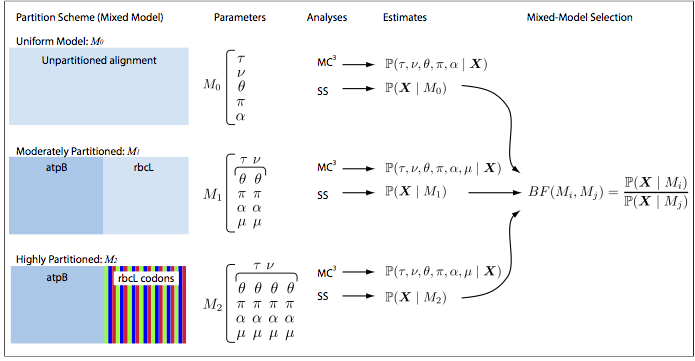

# MrBayes
## Introduction
MrBayes is a free program for the Bayesian estimation of phylogeny, developed by John Huelsenbeck, Bret Larget, Paul van der Mark, Fredrik Ronquist, and Donald Simon. MrBayes 3.2 features include (for a full list of features visit MrBayes [website](http://nbisweden.github.io/MrBayes/)):

* Analysis of nucleotide, amino acid, restriction site, and morphological data;
* Mixing of data types, such as molecular and morphological characters, in a single analysis;
* An abundance of evolutionary models, including 4 X 4, doublet, and codon models for nucleotide data and many of the standard rate matrices for amino acid data;
* Estimation of positively selected sites in a fully hierarchical Bayesian framework;
* Full integration of the BEST algorithms for the multi-species coalescent.
* Support for complex combinations of positive, negative, and backbone constraints on topologies;
* Model jumping across the GTR model space and across fixed rate matrices for amino acid data;
* Implementation of the stepping-stone method for accurate estimation of model likelihoods for Bayesian model choice using Bayes factors;

Note that version 3.2 is the last major version of MrBayes.  Further development will occur in the [RevBayes project](https://revbayes.github.io/).

Tracy Heath, Conor Meehan, and Brian Moore wrote an excellent MrBayes [tutorial](http://treethinkers.org/tutorials/phylogenetic-inference-using-mrbayes-v3-2/) for workshops on applied phylogenetics and molecular evolution, which I abbreviated for this lab.  I encourage you to read the original version on your own to get a better understanding of the theory involved.

## Getting Started
### Software
Download the newest versions of MrBayes, [Tracer](https://github.com/beast-dev/tracer/releases/tag/v1.7.1), and [FigTree[(https://github.com/rambaut/figtree/releases), if you work on your own computer. 

### Datasets

The datafile for the exercises are in Lab5 directory of the course repository.

## Exercise 1: Model Selection & Partitioning using Bayes Factors
### Overview
The goal of the first exercise is to select a partitioning scheme for a dataset. 
For most sequence alignments, several to many partition schemes of 
varying complexity are plausible a priori and the choice of a 
partitioning scheme may influence the results of the analysis. Our goal, therefore, is to  identify the partition scheme that balances estimation bias and error variance associated with under- and over-parameterized mixed models, respectively. In Bayesian inference, this goal is achieved based on Bayes factors, which compare the ratio of the marginal likelihoods for the set of candidate partition schemes. The analysis pipeline that we will use in this tutorial is depicted below:



Open the file `conifer\_dna.nex` in your text editor. This file contains the sequences for 2 different genes sampled from 9 species. The elements of the DATA block indicate the type of data, number of taxa, and length of the sequences.
Open the batch file, `conifer\_partn.nex`, in a text editor. This file contains all of the commands required to perform the necessary analyses to explore various partition schemes (unpartitioned, partitioned by gene region, and partitioned by gene region+codon position). The details of each command are described in adjacent comments, surrounded in brackets; e.g., [this is a comment].

## Running the analysis
The overall outline of an MrBayes analysis looks like this:

* Start the program with `mb` 
* Use `execute` to read data from a Nexus file into MrBayes 
* Set the model and priors using `lset` and `prset` commands
* Run the chain using `mcmc` 
* Summarize the parameter samples using `sump` 
* Summarize the tree samples using `sumt` 

Note that MrBayes runs two independent Metropolis-coupled analyses by default.
 
Typically, we would perform these analyses by simply executing a batch file containing these commands. However, in this exercise we will walk through the different steps interactively in the command line.
 
First, execute the MrBayes binary by typing `mb`. The program will start and the prompt will change to `MrBayes >`.  

Execute the help function by typing:

```
help
```
This displays a list of the different elements and commands available in MrBayes. To view more info on each item in the list, type help [name of the item], _e.g._:

```
help log
```
We will use the `log` command to save all of the screen output from our analysis to a file called conifer-partn-log.txt.

```
log start filename=conifer-partn-log.txt
```
Next, load the sequences into the program with `execute` or `exe`.

```
execute conifer_dna.nex
```
Finally, define the outgroup taxon:

```
outgroup Ginkgo_biloba
```
Note, that the last command merely affects the display of trees. It says we want trees to be rooted between the taxon Ginkgo_biloba and everything else.

### An unpartitioned analysis
#### Setting the model
We first perform an analysis on the unpartitioned alignment using the GTR+Γ model. This corresponds to the assumption that the process that gave rise to our data was homogeneous across all sites of the alignment. The `lset` command is used to specify the details of our sequence model:

```
lset nst=6 rates=gamma
```
This command specifies a substitution matrix with six relative substitution rates (nst=6) with gamma-distributed rate variation across sites (rates=gamma). Because models are specified this way, some DNA models are not available in MrBayes. With the nst element of the lset command, we can specify the JC69 or F81 models (nst=1), the K2P or HKY models (nst=2), or the GTR model (nst=6).

In Bayesian analysis we treat parameters as random variables, which requires that we specify a prior probability density for them. Accordingly, we need to specify priors for all of the parameters of the specified nucleotide substitution model. The command for modifying priors is `prset`. Use the help command to view the list of priors available for modification and their current values: 

```
help prset
```
The help page starts with a short explanation of each prior option. Let's go through some important priors:
First, we have a flat Dirichlet prior on the 6 exchangeability parameters: revmatpr=dirichlet(1,1,1,1,1,1);
We also have a flat Dirichlet prior on the 4 base frequencies (πA, πC, πG, πT): statefreqpr=dirichlet(1,1,1,1)
We also need a prior for the rates heterogeneity. The default value of the Shapepr is Uniform(0.0,200.0). We will change it to an exponential distribution with a rate parameter, λ, equal to 0.05. You can use R to look at the shape of this distribution.

```
prset shapepr=exponential(0.05)
```
Now we have specified a simple, single-partition analysis. To review the various model settings and parameters that we have specified for this dataset use the showmodel command:

```
showmodel
```
#### Setting and running the MCMC
One can specify the details of the MCMC simulation using either the `mcmcp` or `mcmc` commands. The first of them reads in the settings for the MCMC simulation, but does not initiate the MCMC analysis. By contrast, `mcmc` reads in the settings and then immediately initiates the run. To see the default values for the analysis use:

```
help mcmc
```
Let's change the values for the number of cycles of MCMC and the frequencies with which the Markov chain is samples and the information is printed on the screen:

```
mcmcp ngen=300000 printfreq=100 samplefreq=100
```
Notice that by default, MrBayes will run 2 independent analysis with 4 chains each (i.e., Metropolis-coupled MCMC) and sample the branch-length information as well as the topological states. These options can be set explicitly with:

```
mcmcp nruns=2 nchains=4 savebrlens=yes
```
MrBayes will also run convergence diagnostics for the two analyses, which can be modified with:

```
mcmcp diagnfreq=1000 diagnstat=maxstddev
```
Finally, to keep track of various files we will set the file-name prefix to conifer-uniform:

```
mcmcp filename=conifer-uniform
```

Run the analysis by typing `mcmc` and say no to the option to continue sampling once the chain has reached ngen iterations. The convergence diagnostics we've chosen (the maximum standard deviation of split frequencies) monitors the topological similarity of trees sampled by the two independent analyses. A low standard deviation indicates that the data points (split frequencies) tend to be close to the mean, suggesting that the trees sampled by the independent chains are similar and presumably sampled from the same (stationary) distribution. By contrast, high values of the standard deviation suggest that the trees sampled by the independent chains are quite different and presumably not sampled from the same (stationary) distribution

#### Running the stepping-stone sampling
In the Bayesian framework, model selection is typically performed through the evaluation of a Bayes factor, the ratio of marginal likelihoods for the two models. Commonly, marginal likelihood was calculated by harmonic mean estimator. New techniques to estimate (log) marginal likelihoods, such as path sampling and stepping-stone sampling, offer increased accuracy over the traditional method. In this part of the exercise, we will estimate marginal likelihood of the unpartitioned model using stepping-stone sampling. 

Specify the parameters of the stepping-stone sampling analysis using the ssp command:

```
ssp ngen=100000 diagnfreq=1000 filename=conifer-uniform-ss 
```

Now execute the analysis:

```
ss
```

Once the stepping-stone sampling run has completed, the estimated stepping-stone marginal likelihood for the uniform partition is reported to the screen. Record the Mean marginal likelihood for the 2 runs.

### Partitioning by gene region
#### Setting the model
The dataset we use in this exercise contains two distinct gene regions—atpB and rbcL—so we will explore the possibility that the substitution process differs between these two gene regions. This requires us to specify the data partitions corresponding to these two genes and to define a substitution model for each data partition.

First, use the charset command to define the subset of sites belonging to each of the gene regions (in our case sites 1–1,394 belong to the atpB gene and sites 1,395–2,659 are from rbcL):

```
charset atpB = 1-1394
charset rbcL = 1395-2659
```
Then define our partition configuration using the partition command:

```
partition partition-by-gene = 2: atpB, rbcL
```
Finally, set the partition scheme to partition-by-gene:

```
set partition=partition-by-gene
```
We will assume that both genes evolved under the GTR+Γ model:

```
lset applyto=(all) nst=6 rates=gamma
```
As in the first part of this exercise, we can also specify the priors using the prset command. However, we'll just keep the values from the previous exercise.

At this point, the parameters for each gene are linked, and if we ran the MCMC under these settings, we would be performing an unpartitioned analysis. We must now unlink the parameters for each gene so that they will be estimated independently:

```
unlink revmat=(all) statefreq=(all) shape = (all)
```
Now, each gene has a set of partition-specific parameters. Next, we must allow the overall substitution rate to vary across the subsets of our alignment. This is done using the prset command: 

```
prset applyto=(all) ratepr=variable
```

#### Setting and running the MCMC
We are now ready to set up the MCMC and run our chains:

```
mcmcp ng=300000 printf=100 samp=100 diagnf=1000 diagnst=maxstddev
mcmcp nch=4 savebr=yes filename=conifer-partn
mcmc
```

#### Running the stepping-stone sampling  
Set up and execute a stepping-stone analysis to approximate the marginal likelihood of this model specification:

```
ss ng=100000 diagnfr=1000 filename=conifer-partn-ss
```

Record the Mean marginal likelihood for the 2 runs.

### Partitioning by codon position and by gene
#### Setting the model
It is common to partition coding sequences by codon position in addition to the gene region. For this exercise, we will do such partitioning for the rbcL gene. When partitioning by codon position we can use specific notation to indicate that every third base-pair belongs to a given charset:

```
charset rbcL1stpos = 1395-2659\3 
charset rbcL2ndpos = 1396-2659\3
charset rbcL3rdpos = 1397-2659\3
```
Notice that each charset begins with a different character position in our alignment but ends with the same!

Now we will specify four different subsets of the alignment: the entire atpB gene, rbcL 1st positions, rbcL 2nd positions, and rbcL 3rd positions:

```
partition sat-partition = 4: atpB, rbcL1stpos, rbcL2ndpos, rbcL3rdpos
set partition=sat-partition
```

We will again assume a GTR+Γ model for every character set, but unlink the parameters across our subsets.

```
lset applyto=(all) nst=6 rates=gamma
prset revm=dir(1,1,1,1,1,1) statef=dir(1,1,1,1) shape=expon(0.05)
unlink revmat=(all) statef=(all) shape=(all)
prset applyto=(all) ratepr=variable
```

#### Setting and running the MCMC
```
mcmcp ng=300000 printf=100 samp=100 diagnf=1000 diagnst=maxstddev
mcmcp nch=4 savebr=yes filename=conifer-sat-partn
mcmc
```

#### Running the stepping-stone sampling
```
ss ng=100000 diagnfr=1000 filename=conifer-sat-partn-ss
```

*Don't forget to record the Mean marginal likelihood for the 2 runs!*

### Summarizing MCMC samples
MrBayes has two commands for summarizing MCMC samples of trees and other parameters: `sumt` and `sump`. The `sumt` command summarizes the samples of the tree topology and branch lengths and sump summarizes all of the other model parameters (e.g. base frequencies, shape parameter, etc.).

Check the current settings for the two commands:

```
help sump
help sumt
```

#### Summarizing the scalar parameters

Assess the scalar parameters sampled by MCMC for our 3 different analyses using the `sump command`:

```
sump filename=conifer-uniform
```
Upon completion of the sump command, you will see a table listing the estimated marginal likelihoods of these analyses.

* Record the marginal likelihood estimated by the harmonic mean for the uniform partition analysis.
* Review the table summarizing the MCMC samples of the various parameters.

This table also give the 95% credible interval of each parameter. This statistic approximates the 95% highest posterior density (HPD) and is a measure of uncertainty while accounting for the data (MrBayes labels this value as 95% HPD). More specifically, the probability that the true value of the parameter lies within the credible interval is 0.95 given the model and the data.

Now, make a summary of sclar prameters for the moderately partitioned run and the highly partitioned run and record the Harmonic mean estimate of the marginal likelihood for each.

```
filename=conifer-partn
sump filename=conifer-sat-partn
```

Now that we have estimates of the marginal likelihood under each of our different models, we can evaluate their relative plausibility using Bayes factors. 

Use the table below (or one like it) to summarize the marginal log-likelihoods estimated using the harmonic mean and stepping-stone methods.


|   partition  |  harmonic mean  |  stepping stone  |  
|--------------|:---------------:|:----------------:|  
| uniform (M1) |                 |                  |  
| by gene (M2) |                 |                  |
| by gene and codon <br>position (M3) | |           |

Phylogenetics software programs log-transform the likelihood to avoid underflow, because multiplying likelihoods results in numbers that are too small to be held in computer memory. Thus, we must use a different form of Bayes factors equation to calculate the ln-Bayes factor (we will denote this value K):

```
K = ln[BF(M0,M1)] = ln[P(X | M0)] − ln[P(X | M1)]
```
where `ln[P(X | M0)]` is the marginal lnL estimate for model M0. The value resulting from equation 4 can be converted to a raw Bayes factor by simply taking the exponent of K:

```
BF (M0, M1) = e^K
```

Alternatively, you can interpret the strength of evidence in favor of M0 using the K and skip the equation above. In this case, we evaluate the K in favor of model M0 against model M1 so that:

if K > 1, then model M0 wins

if K < −1, then model M1 wins.

Values of K around 0 indicate ambiguous support.

> Do the Bayes factor comparison for the three partitioning schemes we used in our analysis. What do your results mean?

Note that Bayes factors based on comparison of HM-based marginal likelihoods often strongly favor the most extremely partitioned mixed model. In fact, the harmonic mean estimator has been shown to provide unreliable estimates of marginal likelihoods, compared to more robust approaches. In fact, it is recommended that you avoid using HM-derived marginal likelihoods for Bayes factor comparisons.

#### Summarizing the trees
Use `sumt` command to summarize the tree topologies and branch lengths sampled by MCMC for each of the different analyses: 

```
sumt filename=conifer-uniform
sumt filename=conifer-partn
sumt filename=conifer-sat-partn
```
The primary summary performed by sumt calculates the clade credibility values (i.e., bipartition posterior probabilities). These values are reported on an ASCII cladogram upon completion of the sumt command. The sumt command also writes the majority-rule consensus tree to a NEXUS tree file with the file-name extension *.con.tre. The trees in these files are also annotated with various branch- or node-specific parameters or statistics in an extended Newick format called NHX. 

Use FigTree to visualize these summary trees.

We are done with our first exercise so you can quit MrBayes!

```
quit
```
## Exercise 2: Averaging Over the GTR Family of Models

Model selection using maximum-likelihood methods (e.g., the likelihood-ratio test, AIC, BIC, etc.) has been a standard practice in the field of molecular phylogenetics. However, such approach ignores uncertainty in the choice of the model and can cause estimates to be biased. The Bayesian framework provides a more natural approach for accommodating model uncertainty by treating the models (like the parameters within each model) as random variables. Bayesian model averaging has been implemented for various phylogenetic problems using reversible-jump MCMC, where the chain integrates over the joint prior probability density of a given model in the usual manner, but also jumps between all possible candidate substitution models, visiting each model in proportion to its marginal probability. Here, we will demonstrate how to use this approach using MrBayes.

Start MrBayes by typing `mb`. The program starts and greets you with some info and the prompt: `MrBayes >`.  

Save the screen output to file:

```
log start filename=conifer-rjmcmc-log.txt
```
We will use the same 9-taxon conifer dataset. Load the sequences into MrBayes and specify Ginko biloba as the outgroup.

```
execute conifer_dna.nex
outgroup Ginkgo_biloba
```

### Setting the model
We specify model averaging in MrBayes using the lset command:

```
lset nst=mixed rates=gamma
```

MrBayes will then use rjMCMC to sample among all 203 models in the GTR family in proportion to their marginal posterior probability, including all models that can be individually set in MrBayes as well as a large number of others, with or without name.

We will leave the remaining parameters and priors specified to the program default values. Evaluate your model specification:

```
showmodel
```
### Running under the prior
For Bayesian analysis, it’s critical to examine the various priors specified and identify induced priors that may result from interactions between parameters. This procedure is done by generating samples of the various parameters and hyperparameters under the prior, without accounting for the data. This is also often called “running on empty”. 

In MrBayes, running under the prior is specified in the mcmc/mcmcp command by the option `data=no`. When generating samples under the prior with MCMC, the only important concern is that you have a sufficient number. Therefore, it is not necessary to run multiple chains or multiple independent runs.

Use the mcmcp command to specify the details of the Markov chain:

```
mcmcp data=no nruns=1 nchains=1
```
When you set data=no, the program simply disregards the sequence data by returning a constant every time the likelihood function is called. Accordingly, running on empty takes very little time.

Set the number of generations equal to 2,000,000 using the mcmcp command: 

```
mcmcp ngen=2000000 printfreq=100 samplefreq=100
```
You are ready to run the analysis. Set the file name prefix to conifer-rjmcmc-prior when you execute the mcmc command:

```
mcmc filename=conifer-rjmcmc-prior
```

We will use Tracer for examining marginal prior and posterior densities for Bayesian phylogenetic analysis. Evaluating the parameter samples under the prior can often help to identify misspecified priors or errors in your analysis set-up. When examining prior densities, we are only concerned with the values reported to the parameter file (*.p). There is no manual for Tracer.  However, some explanation for different options is available on its website.

Open the file called conifer-rjmcmc-prior.p in Tracer. 

Look through each of the parameters, paying close attention to the shapes of the distributions in the Marginal Probability Distribution pane.

Inspect the marginal densities of the relative exchangeability rates. Under this prior, the rates are sampled from a mixture of distributions, thus these look unlike any obvious parametric density. For this exercise, we are primarily interested in the variables relevant to the mixed model over GTR submodels. These include gtrsubmodel and k_revmat. The k_revmat statistic indicates the number of unique rate values in the GTR matrix. The trace called gtrsubmodel gives the model in the GTR family sampled by MCMC. 

We have verified that the marginal prior densities of the relevant parameters match the expected densities. In addition, sampling under the prior provides a straightforward way to assess whether the data are informative for the numerous parameters and hyperparameters in our model. This is done by comparing the marginal prior densities to the marginal posterior densities (after running with data).

### Data analysis
We will return to MrBayes and run two independent Metropolis-coupled MCMC (MC3) with 4 chains each:

```
mcmcp data=yes nruns=2 nchains=4 savebrlens=yes
```
For the sake of saving time, we will specify fewer steps for the Markov chain. (Ideally we would run MCMC much longer!)

```
mcmcp ngen=100000 printfreq=100 samplefreq=100
```
Set the diagnostics to maxstddev every 1,000 iterations:

```
mcmcp diagnfreq=1000 diagnstat=maxstddev
```
Run the analysis with mcmc command and specify the output file name.

```
mcmc filename=conifer-rjmcmc
```

Once the Markov chain is completed, summarize the MCMC samples of the scalar parameters using the sump command:

```
sump filename=conifer-rjmcmc
```

The sump command will generate tables showing summary statistics of the model parameters and the different GTR submodels with posterior probability over 0.05. For these data, the analysis shows that only a few of the 203 GTR submodels have posterior probability over 0.05. Furthermore, no single model stands out as the “best” model with a significantly high probability.

We can get a more detailed view of these features of our data when we evaluate the marginal densities of the gtrsubmodel and k_revmat in Tracer. 

Open all of the *.p files from this exercise in Tracer:

<!---
tracer conifer-rjmcmc-prior.p conifer-rjmcmc.run1.p conifer-rjmcmc.run2.p
--->

Color the marginal densities of each run by selecting Colour by: Trace File in the pull-down menu at the botom of the window. Also, choose Legend: Top-Left to place a key in the graph.

> What do you see?

Return to MrBayes and summarize the tree topology and branch lengths: 

```
sumt filename=conifer-rjmcmc
```

Open the summary tree in FigTree and make a figure that shows the bipartition posterior probabilities

Quit the program and we are done with the second exercise!

```
quit
```

## Exercise 3: Testing a Topological Hypothesis

For the third exercise, we will use Bayes factor comparisons to test a topological hypothesis, in this case an old one, that humans are more closely related to chimps than to other primates. This exercise is described starting on page 52 in MrBayes manual and we will just follow the procedure from the manual. This is done, in part, as an opportunity for you to run other types of analyses described in the manual, while the rest of the class finishes their work.

Here is a quick summary of the exercise:

Start MrBayes application by typing `mb` in the terminal

Save the screen output to file:

```
log start filename=human-chimp.log.txt
```

Load the sequences into MrBayes (we will use a new dataset):

```
execute primates.nex
```

### Setting the model
Set the GTR + I + Γ  model for the analysis:

```
lset nst=6 rates=invgamma
```

Specify the taxonomic constraints using the following commands:

```
constraint humanchimp = Homo_sapiens Pan
constraint nohumanchimp negative = Homo_sapiens Pan
```

We will leave the remaining parameters and priors specified to the program default values. Evaluate your model specification:

```
showmodel
```

### Testing a topological hypothesis
As we have seen above, MrBayes provides two methods for estimating marginal model likelihoods. The first is based on the harmonic mean of the likelihood values of the MCMC samples. It is simple to compute but it is a pretty rough estimate of the model likelihood. To obtain a more accurate model likelihood, MrBayes provides the stepping-stone method 

#### Harmonic mean
We'll start by using the harmonic mean estimate of the model likelihoods of the two models we want to compare. 

First we enforce the positive constraint, run an mcmc analysis with 100,000 generations, and use sump to get the harmonic mean estimate:

```
prset topologypr=constraints(humanchimp)
mcmc ngen=100000
sump
```

In the output from the sump command, focus on the table summarizing the likelihoods of the MCMC samples and use the harmonic mean for Bayes factor comparisons of models.

Now we enforce the negative constraint, and repeat the procedure using the commands:

```
prset topologypr=constraints(nohumanchimp)
mcmc ngen=100000
sump
```

Write down harmonic mean estimate.

It may also be interesting to look at the best estimate of the phylogeny under the assumption that humans and chimps are not each others sister groups. Do this by typing `sumt`. As you will see, this tree groups chimps and gorillas together, with humans being just outside, as one might have expected.

#### Stepping-stone sampling
Let us now repeat the comparison using the more accurate stepping-stone sampling approach. Instead of using the mcmc command followed by the sump command, we simply use the ss command, which will produce the estimated model likelihood directly. 

<!--
The stepping-stone analysis moves from the posterior to the prior through a number of steps in which the sampled distribution is a mixture of varying proportions of the two.
-->

We will use 50 steps (the default) with 5,000 generations each, for a total of 250,000 generations. To monitor convergence twice during each step, we set the diagnostics frequency to once every 2,500 generations. Stepping-stone analysis under the two models using these settings will be generated by the following commands:

```
prset topologypr=constraints(humanchimp)
ss ngen=250000 diagnfreq=2500
prset topologypr=constraints(nohumanchimp)
ss
```

The output from the ss command will include a table with marginal likelihood estimated using stepping-stone sampling. Compare marginal likelihood estimates for the two models.

If you have any time left, rerun the analysis above using a simpler model of sequence evolution (e.g., JC, no gamma). How did the choice of model influence your conclusion about the two phylogenetic hypotheses?
