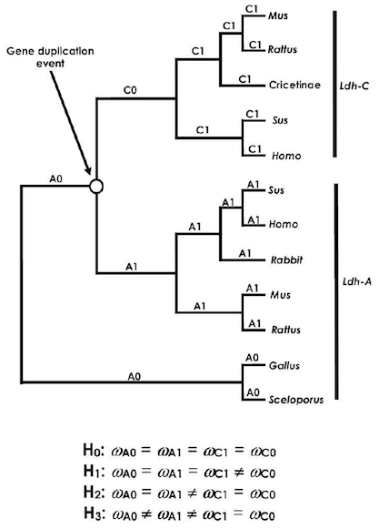
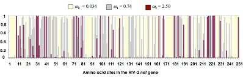

# Lab #6 Hypothesis Testing and Detecting Selection with PAML
### Expected learning outcomes

The objective of this activity is to help you understand how to use PAML program, and how to test hypothese using the Maximum Likelihood approach.  There are many more applications of PAML (see below).  Check its [manual](http://abacus.gene.ucl.ac.uk/software/pamlDOC.pdf){:target="_blank"} and [FAQs](http://abacus.gene.ucl.ac.uk/software/pamlFAQs.pdf){:target="_blank"} for additional ideas.

The exercises we will be doing today follow a [tutorial](http://evomics.org/learning/phylogenetics/paml/){:target="_blank"} prepared by Joe Bielawski based on a [book chapter](./PAML_chapter.pdf){:target="_blank"} by Bielawski and Yang (2005).

### Introduction
PAML is *a package* of programs for phylogenetic analyses of DNA or protein sequences using maximum likelihood. It is maintained and distributed for academic use free of charge by Ziheng Yang. Examples of analyses that can be performed using the package include:  

* Comparison and tests of phylogenetic trees (`baseml` and `codeml`);  
* Estimation of parameters in sophisticated substitution models
 (`baseml` and `codeml`);  
* Likelihood ratio tests of hypotheses through comparison of implemented models (`baseml`,
`codeml`, `chi2`);  
* Estimation of divergence times under global and local clock models (`baseml` and `codeml`);  
* Likelihood (Empirical Bayes) reconstruction of ancestral sequences using nucleotide, amino acid and codon models (`baseml` and `codeml`);  
* Generation of datasets of nucleotide, codon, and amino acid sequence by Monte Carlo
simulation (`evolver`);  
* Estimation of synonymous and nonsynonymous substitution rates and detection of positive
selection in protein-coding DNA sequences (`yn00` and `codeml`).
* Bayesian estimation of species divergence times incorporating uncertainties in fossil calibrations (`mcmctree`).

The strength of PAML is its collection of sophisticated substitution models.  Tree search algorithms implemented in `baseml` and `codeml` are rather primitive, so except for very small data sets with say, <10 species, you are better off to use another package, such as phylip, paup, or mrBayes, to infer the tree topology.  You can get a collection of trees from other programs and evaluate them using `baseml` or `codeml` as user trees.

### Getting Started.
#### Software

PAML is alredy installed on the HPC-class (module paml). To use it, run:  

```
salloc -N 1 -n 4 -t 2:00:00;  
module load paml;  
name_of_the_paml_program
```

You can also install PAML on your computer from its [website](http://abacus.gene.ucl.ac.uk/software/paml.html){:target="_blank"}.

*Note:* For the exercises below we will use a single program from the paml package: `codeml`.

#### Data
The data for this exercise is in the `lab6` directory on the GitHub repository.

### Exercise 1: ML estimation of the dN/dS (ω) ratio “by hand”
For this exercise, we will use a simple data set and the `codeml` program to
illustrate maximum likelihood estimation of ω. The data set is GstD1 genes of
_Drosophila melanogaster_ and _D. simulans_. The alignment has 600 codons.
Our first objective is to evaluate the likelihood function for a variety of fixed values for the parameter ω.
Plot log-likelihood scores against the values of ω and determine the maximum likelihood estimate of ω.
Check your finding by running CODEML’s hill-climbing algorithm.  

1. Unzip files for exercise 1 (and 2) and familiarize yourself with them.
  - Pay close attention to the modified control file called codeml.ctl.ex1.
  - When you are ready to run CODEML, delete the .ex1 extension (the control file must be called codeml.ctl for the program to run).  
2. Move to the directory that contains your files, and run CODEML.  
3. Familiarize yourself with the [results](./help_files/ex1_HelpFile.pdf){:target="_blank"}.
  - If you have not edited the control file the results will be written to a file called results.txt.
  - Identify the line within the results file that gives the likelihood score for the example dataset.
4. Now change the control files and re-run CODEML. The objective is to
compute the likelihood of the example dataset given a fixed value of omega.
  - Change the name of your result file (via `outfile=` in the control file) or you will overwrite your previous results!  
  - Change the fixed value for omega by changing `omega=` in the control file. The values for this exercise are provided as comments at the bottom of the example control file.  
5. Repeat step 4 for each value of omega given in the comments of the example control file.  
6. Plot the likelihood score (y-axis) against the fixed value for omega (x-axis). Use a logarithmic scale for the x-axis.  
7. From the plot, try to guess the value of omega that will maximize the likelihood score (i.e., the MLE).
8. Now change the control file so that CODEML will use its hill-climbing algorithm to find the MLE; setfix_omega=0 in the control file. Compare the result to your guess from step 7.

### Exercise 2: Sensitivity of the dN/dS ratio to assumptions
In this exercise you will investigate the sensitivity of your estimate of ω
to the other parameters in the model, in particular transition/transversion ratio (κ),
and assumed model for codon frequencies (πi’s). After you collect the required data
you will determine which assumptions yield the largest and smallest values of S,
and what is the effect on ω.

1. Examine the files for Exercise 2 (downloaded in the previous exercise).
It would be best to create a new directory for exercise 2.
2. Run `codeml` using the settings in the control file for exercise 2. Familiarize yourself with the [results](./help_files/ex2_HelpFile.pdf){:target="_blank"}. In addition to the likelihood score you must be able to identify the part of the result file that provides estimates of the following:
	- Number of synonymous or nonsynonymous sites (S and N)
	- Synonymous and nonsynonymous rates (dS and dN)
3. As in exercise 1, you will need to change the control files and re-run CODEML. The objective is to compute the likelihood of the example dataset under different model assumptions. To do this you must:
	- Change the name of the main result file (via `outfile=` in the control file) or you will overwrite your previous results
	- Change the model assumptions about codon frequencies (via CodonFreq=) and kappa (via `kappa=` and `fix_kappa=`).
4. Repeat step 3 for each set of assumptions about codon frequencies and kappa given as comments at the bottom of the example control file.
5. In your favorite spreadsheet program create a table like [this](./help_files/TableE2.pdf){:target="_blank"} and fill it in with your results.
6. Use your table to determine which assumptions yield the largest and smallest values of S. What is the effect on omega?

### Exercise 3: Testing hypotheses about molecular evolution of LDH

In this exercise we will explore the variation in selective pressure among branches in *Ldh*. The lactate dehydrogenase (Ldh) genes found in mammals originated from a duplication near the origin of vertebrates (Ldh-A and Ldh-B) and a later duplication near the origin of mammals. Previously it was found that the rate of evolution had increased in mammalian Ldh-C sometime following the second duplication event. An unresolved question about this gene family is whether the increased rate of Ldh-C reflects (i) a burst of positive selection for functional divergence following the duplication event, (ii) a long-term change in selective pressure, or (iii) simply an increase in the underlying mutation rate of Ldh-C. In the following, we use the LRT for variable ω ratios among branches to test these evolutionary scenarios.

1. Unzip the files for Exercise 3 and familiarize yourself with them. The tree files represent different hypotheses denoted H0, H1, H2 & H3 (LDH_tree.pdf). These hypotheses represent the following concepts:
	- H0: homogeneous selection pressure over the tree; rate increase in _Ldh-C_ is simply due to an underlying increase in the mutation rate;
	- H1: episodic change in selection pressure in Ldh-C (only in the branch that immediately follows the gene duplication event).
	- H2: Long term shift in selection pressure in Ldh-C only; Ldh-C has a permanent change in selection pressure (as compared to its ancestors) whereas Ldh-A remains subject to the ancestral level of selection pressure.
	- H3: Long term shift in selection on both Ldh-C and Ldh-A; those lineages are subject to selection pressures different from each other and from the ancestor.
2. Run `codeml` using the settings in the control file for Exercise
3. Familiarize yourself with the [results](./help_files/ex3_HelpFile.pdf){:target="_blank"}. In addition to the likelihood score you must be able to identify the branch-specific estimates of the omega parameter. (In the first run, the branch specific values for omega will all be the same. In later runs there will be differences among some branches).
4. As in the previous exercises, you will need to change the control files and re-run `codeml`. The objective is to compute the likelihood, and estimate omega parameters, under different models of how selection pressure changes in different parts of the tree. Because the relevant model information is contained in the tree file, you will need several tree files (obtained from the course web site) and change the control file so that it reads the different tree files.
	- As previously, you should change the name of the main result file (via `outfile=` in the control file) or you will overwrite your previous results.
	- Change the model assumptions about branch specific omega values by changing the tree files (viatreefile= and model=) set within the control file.
5. Repeat step 3 for each of the four tree files that have been provided to you. Again, keep track of your results by using a table like [Table3](./helpfiles/TableE3.pdf){:target="_blank"}. In addition, carry out likelihood ratio tests (LRT) of the hypotheses below. Use 1 degree of freedom for each LRT. Helpful: [Chi-Square Calculator](http://www.socscistatistics.com/pvalues/chidistribution.aspx){:target="_blank"}.
	- H0 vs. H1
	- H0 vs. H2
	- H2 vs. H3

### Exercise 4: Testing for adaptive evolution in the _nef_ gene of human HIV-2

The data for this exercise come from Padua et al. 2003, who sequenced 44 _nef_ alleles from a study population of 37 HIV-2-infected people living in Lisbon, Portugal. They found that nucleotide variation in the _nef_ gene, rather than gross structural change, was
potentially correlated with HIV-2 pathogenesis. In order to determine whether
the _nef_ gene might also be evolving under positive selective pressure in HIV-
2, we will analyzed these data here with models of variable ω ratios among
sites. If you find significant evidence for positive selection, then identify the involved sites by using empirical Bayes methods.

The following models: M0 (one ω), M1a (neutral), M2a (selection),
M3 (discrete), M7 (beta), and M8 (beta & ω) will be used. Models M0 and M3 were
described above. M1a (neutral) specifies two classes of sites: conserved sites
with ω < 1 estimated from the data and neutral sites with ω = 1.
M2a (selection) is an extension of M1a (neutral), adding a third ω class that is free to take a value > 1. Under model M7 (beta), ω varies among sites according to a beta distribution with parameters p and q. The beta distribution is restricted to the interval (0, 1); M8 (beta & ω) adds a discrete ω class to the beta distribution that
is free to take a value > 1. Under M8 (beta & ω), a proportion of sites p0
is drawn from a beta distribution, with the remainder (p1 = 1 − p0) having
the ω ratio of the added site class.

1. Unzip files for exercise 4 and familiarize yourself with them.
2. If you plan to run two or more models at the same time, then create a separate directory for each run and place a sequence file, control file and tree file in each one.
3. As in previous exercises, you will need to change the control file and re-run CODEML several times. In this case you will be fitting six different codon models (M0, M1a, M2a, M3, M7 & M8) to the example dataset.  
	* If you are running your analyses sequentially in the same directory, then you should change the name of the main result file (via `outfile=` in the control file) or you will overwrite your previous results.
	* Set the tree file with `treefile=`. I have supplied tree files pre-loaded with the ML branch lengths for each model (hence you need to set a different tree for each model). This will greatly speed up your analyses. See the example control file for more details about treefile names.
	* Set the codon model with `NSsites=`.
	* Fix the value of kappa at the ML estimate with `kappa=`. Again, this will help speed up the analysis. See the control file for the value of kappa for each model.
	* For some models you will also need to set the number of categories (ncatG) in the omega distribution:
		- For M3 set ncatG=3
		- For M7 set ncatG=10
		- For M8 set ncatG=10
	* Once the analysis is complete, rename the rst file because subsequent runs will overwrite it!
	* Repeat steps a. through f. for each of the six codon models listed above.
4. Keep track of your [results](./help_files/ex4_HelpFile.pdf){:target="_blank"} by using a table like [this](./help_files/TableE4.pdf){:target="_blank"}.
5. In addition, carry out the following likelihood ratio tests:
	* M0 vs. M3 (4 degrees of freedom)
	* M1a vs. M2a (2 degrees of freedom)
	* M7 vs. M8 (2 degrees of freedom)
6. Lastly, open the rst file generated when you ran model M3 (ex4_rst_HelpFile.pdf). Locate the columns of posterior probabilities for each site under the three site-categories of this model. Use these data to reproduce the plot shown below.


