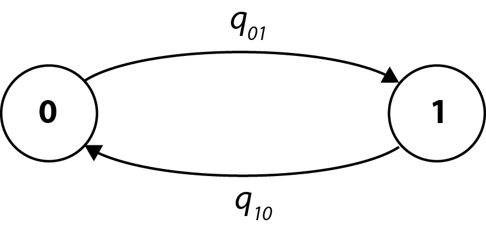
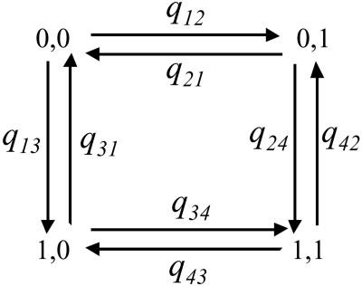

# BayesTraits Tutorial
## Exercise 1: Using BayesTraits to estimate the model of evolution and ancestral states for a binary trait

This is an example showing how to calculate a likelihood and estimate the model of evolution using the data on primate mating systems reported in a study by Pagel and Meade (American Naturalist, 2006). 
For purposes of this example, consider that primate mating systems can be classified as multimale (females mate with more than one male) or unimale/monogamous. 
We assign a "1" to primates with a multimale mating system and a "0" otherwise.

Then the model of evolution will be very simple with two states (0 and 1) and two rates (q_01 and q_10) for transitions between the two states:

  


The file MatingSystem.txt contains mating system data for a variety of primate species; primate phylogenetic trees are in Primates.trees(we use more than one to account for phylogenetic uncertainty).  
<br>

### Using Maximum Likelihood.
#### Estimating the model

* Start by changing into the directory where the files are located (e.g., `cd ~/EEOB563-Spring2025/computer_labs/lab8`).
* Type `BayesTraits data/Primates.trees data/MatingSystems.txt` to start the program.
* When prompted for the model of evolution, select MultiState by typing `1`.
* When prompted for the analysis method, select Maximum Likelihood by typing `1`.
* Set the logfile basename to "Run01": `LogFile Run01`
* Type `run` and the program runs and exits.
* Print the LogFile: `cat Run01.Log.txt`. You can see the output for each of the 20 trees in the sample (here the output is shown for only the first 5 trees).

```
Tree No Lh                 q01             q10             Root P(0)     Root P(1)
1         -26.128542     3.025913     1.855426     0.851787     0.148213

2         -25.680979     3.297484     2.040188     0.824616     0.175384

3         -25.423403     2.723676     0.370298     0.997926     0.002074

4         -23.943186     2.540747     1.358796     0.914664     0.085336

5         -25.266580     2.693710     1.121501     0.970575     0.029425
```
The log file shows the tree number and its likelihood given the model, the values of the two rate coefficients and the reconstructed probabilities of the two states at the root of the tree. 
Note that in Likelihood, there is no natural way to combine these results across the trees.

> **Questions to consider:**  
> What is the overall direction of evolution in primate mating system?  
> What was the most likely mating system at the root of the tree?
> Does you inference depend on a particular phylogenetic tree?

> **Alternative way to run BayesTraits**
> Note, that instead of typing the options at the command prompt, you
> can enter them in a control file, and then use input redirection to
> use them for the analysis:
> `BayesTraits data/Primates.trees data/MatingSystems.txt < input.ctl`,
> where your control file looks like:  
> ```
> 1  
> 1  
> LogFile Run01
> run
> ```
> I recommend that you use the latter interface

#### Testing the model
To see if transitions to multimale mating systems occur at a higher rate than transitions to unimale or monogamy, fit a model in which the two rates are constrained to be the same.

Create the following input file:  
```
1
1
LogFile Run02
restrict q01 q10
info
run
```
and run it: `data/BayesTraits Primates.trees data/MatingSystems.txt < input.ctl`

Check the results in `Run02.Log.txt`. 
The rule of thumb is that if this model is two or more log-likelihood units worse than the unconstrained model, then the two rate coefficients differ.

> **Questions to consider:**  
> How do you explain this "rule of thumb"?  
> Can we reject the hypothesis that the two rates are equal?

#### Reconstructing an ancestral state

BayesTraits has two approaches to reconstructing ancestral states.
First, you can use the `Addnode` command. 
The `Addnode` command gives the  program a list of species whose common ancestor is the node you wish to reconstruct. 
The program then finds the proportion of the likelihood associated with each of the possible states at the node. 
The node must exist in the tree for the command to work.

Alternatively, you can use the `AddMRCA` or Most Recent Common Ancestor.
As with Addnode, you give a list of species whose ancestral state you wish to reconstruct. 
An MRCA reconstruction finds the node in each tree in the sample that minimally contains all of the species (tips) whose common ancestral state is of interest. 
In any given tree the MRCA might also include other species.

* Create the following input file:  
```
1
1
LogFile Run03
AddTag GreatApes Pan_paniscus Pan_troglodytes Homo_sapiens Gorilla_gorilla Pongo_pygmaeus Pongo_pygmaeus_abelii
AddNode Node1 GreatApes
AddMRCA Node2 GreatApes
info
run
```
* Run it: `BayesTraits data/Primates.trees data/MatingSystems.txt < input.ctl`

> **Questions to consider:**
> What do you think is the difference between the ways we defined Node1 and Node2?
> What is the ML reconstruction for the type of the mating system in the common ancestor to the Great Apes?

#### Testing an ancestral state: Fossilizing a node

Internal nodes can be set to take a fixed value, if external information is available or to test if the value of one state is significant. 
The `fossil` command takes a name, so the node can be identified in the output, a tag that defines the node and the state or states to fossilise the node in. 
Fossilised nodes are found using the most recent common ancestor method.

Let's test whether one type of a mating system is 'significantly' more likely in the common ancestor of great apes.  
First, replace the `AddNode` and `AddMRCA` commands in the control file with `fossil Node1 GreatApes 0`, which sets the Node1 to state 0.
Update the name of the log file and run the analysis. 
Repeat the analysis but set Node1 to state 1 instead.

> **Questions to consider:**  
> Do you find a significant difference in logL values? (as above, a difference of two log units (for one parameter) is conventionally taken as evidence for a 'significant' difference).
> What does it mean biologically?

## Using Markov Chain Monte Carlo.
We can perform the same analyses as above using MCMC methods. 
The Bayesian analysis can be used to estimate the posterior distribution of parameter values and also to test different models using Stepping stone approach. 
In addition, BayesMultistate implements a reversible-jump MCMC method (see Pagel and Meade, Am. Nat., 2006) that automatically finds the posterior distribution of models of evolution for the data.

### Running MCMC
Restart the program and choose  MultiState (option 1) and  MCMC (option 2).
At this stage you could run the model using conventional MCMC by typing `run` (try it!).
(If you forgot to specify the logfile, your results will be in `data/MatingSystems.txt.Log.txt`)
You will see that the estimated rate coefficients (columns 4 and 5) are rather different from those under maximum likelihood (also the acceptance rate is too high). 
This situation arises because the default priors for the rates are uniform between 0-100 and not restrictive enough for the amount of data we have.

* Change the shape of the priors by using the `PriorAll` command: `PriorAll exp 10` and rerun the analysis.
  
> You can check the shape of this distribution at [this website](http://www.elektro-energetika.cz/calculations/index.php?language=english)
> Note that you can also use a "hyperprior", which is a prior distribution on a "hyperparameter", which is a parameter of a prior distribution. 
> You set a hyperprior by using the `hpall` command. 
> For example, `hpall exp 0 30` will specify an exponential prior seeded from a uniform distribution on the interval 0-30.
> You can also change the number of MCMC steps by using the `it [number]` command, where `it` stands for iteration.

### Comparing the models
#### Stepping stone analysis
To calculate the log likelihood of the model, we will use the stepping stone sampler.
The stepping stone sampler (Xie, Lewis et al. 2011) estimates the marginal likelihood by placing a number of ‘stones’ which link the posterior with the prior, the stones are successively heated, forcing the chain from the posterior towards the prior, providing an effective estimate of the marginal likelihood.

The “stones” command, is used to set the sampler, the command takes the
number of stones and the number of iterations to run the chain on each stone.
The following command sets the sampler to use 100 stones and run each
stone for 1,000 iterations: `stones 100 1000`

* First, re-run the previous analysis, but add the `Stones 100 1000` command:

```
1
2
PriorAll exp 10
Stones 100 1000
Run
```

The file containing the marginal likelihood will be created in `data/MatingSystems.txt.Stones.txt`. 
The last line of this file contain the marginal likelihood.

<!--
roughly -27.5.
-->

* Second, constrain two rates to be equal (as in ML above) and re-run the analysis:

```
1
2
PriorAll exp 10
Stones 100 1000
Restrict q01 q10
Run
```
> **Questions to consider:**  
> What is the marginal likelihood of the constrained model?
> What is the marginal likelihood of the unconstrained model?
<!--
roughly -26.5
-->

To test if the two rates are significantly different, calculate a log Bayes Factor between the two models:

```
Log Bayes Factor = 2(log marginal likelihood complex model – log marginal likelihood simple model)
```

Remember that Log Bayes Factors are interpreted something like:

| Log Bayes Factors | Interpretation |
---- | ---------------------
| <2 | Weak evidence        |
| >2 | Postive evidence     |
|5-10| Strong evidence      |
|>10 | Very strong evidence |

Note that the stepping stone estimate of the marginal likelihood is sensitive to a number of factors, including, priors, length of the chain, number of estimated parameters and run to run variation. 
Care should be taken to ensure estimates are accurate and stable, multiple independent run should be used, the accuracy of the sampler can be increased by using more stones and/or sampling each stone for longer. 
These options should be investigated if there is large run to run variation.

> **Question to consider:**  
> Do the numbers above make sense?  
> What are some advantages of a Bayesian (compared to ML) analysis?

#### Reverse Jump MCMC (Skip this section if you arrived here after 2pm)
For a complex model the number of possible restrictions is large, and may be impossible to test. 
A reverse jump MCMC method (Green 1995) was developed to integrate results over model parameter and model restrictions, for a detailed description see (Pagel and Meade 2006).
The RevJump (RJ) command is used to select reverse jump MCMC, the command takes a prior and prior parameters. 
For example, the command below uses reverse jump with an exponential prior with a mean of 10. 
The second command uses reverse jump with a hyper exponential prior where the mean of the exponential is drawn from a uniform 0 - 30:  

```
RevJump exp 10
RJHP exp 0 30
```

The prior can be “exp”, “gamma”, or “uniform”

We will run Reverse Jump MCMC for model selection by using the following commands:

```
1
2
PriorAll exp 10
rjhp exp 0 30
Run
```

Run the program and check the output. Notice that new columns appeared: #4 ("No off <sic> parameters" ) and #6 ("Model string")

> **Question to consider:**  
> How many parameters are in the selected model?
> What does it mean in terms of rates of change?

Note that the frequency of a given model in the posterior distribution of models is the posterior belief in that ‘hypothesis’.

<!--
### Reconstructing an ancestral state

Start the program and select MultiState and MCMC from the options.
Use `AddMRCA Node-H GreatApes` command to add a node H to be reconstructed (specifying the common ancestor of the Great Apes).
Use `ratedev 8` and `rjhp exp 0 30` to select a deviation of the normal distribution value and to specify a hyperprior
Type `info` to see that the node has been accepted.
Type `run` to run the analysis
To test whether there is support for one state over the other at that node use the fossil command in place of the AddMRCA (`fossil node1 GreatApes 0`).
Run the analysis for at least several millions of iterations.
Repeat this run using `fossil node1 GreatApes 1`
Use stepping stone sampling to estimate the marginal likelihood of the model: `Stones 100 100000`.
The sampler runs after the chain has finished and produces a file with the extension “Stones.txt”,
the log marginal likelihood is recorded on the last line of the file.
The Bayes Factor test is just twice the difference between these two numbers.
What was your Bayes Factor and what does it tell us?
-->

## Exercise 2: Using BayesTraits to test for correlated evolution among pairs of traits.
This exercise explores correlated evolution between mating system in primates and whether or not female primates prominently advertise their estrus: theory predicts that females will advertise in multimale mating systems (see Pagel and Meade, 2006).

What we want to know is if these two characters evolve independently or depend on each other. 
To answer this question, we compare the fit of two models of evolution, one in which the two traits evolve independently on the tree,and one in which they evolve in a correlated fashion.

The model for the evolution of two traits may look like this:


Using maximum likelihood the models can be compared using a likelihood ratio statistic.
In the MCMC mode, we can compare models using Bayes Factors.

The examples in this section use the trees in Primates.trees and
the data in Primates.txt (both in the data directory).

### Bayesian analysis
We use Bayesian approach for the example because it better incorporates phylogenetic
and model uncertainty.

#### Independent model (discrete: independent)
Open the program by typing `BT4-multi data/Primates.trees data/Primates.txt` (notice the change in menu options) and select the Discrete: Independent (Option 2) and MCMC (Option 2).
The independent model assumes the two traits evolve independently, e.g. the transition from 0 → 1 in the first trait is independent of the state of the second trait.

Set all priors to exp 10 and use stepping stone method to calculate marginal likelihood.
Also increase the number of iterations to 5,000,000:

```
PriorAll exp 10
Stones 100 1000
it 5000000
Run
```

> **Questions to consider (while you're waiting for the results)**  
> What do dependent and independent models actually mean?
> How many rate parameters do independent and dependent models have?
> What analysis do you expect to run faster?

** Make sure to write down the marginal likelihood of the independent model
before you go to the next part!**

#### Dependent model (discrete: dependent)
Repeat this analysis above, but choose the Discrete: Dependent option (option 3).
The dependent model assumes that the traits are correlated and the rate of change in one trait is dependent on the state of the other.

```
3
2
PriorAll exp 10
Stones 100 1000
it 5000000
Run
```

#### Testing the two models

Use Bayes Factor to decide which model is better.

#### Reverse Jump MCMC and model reduction
The previous parameter restriction example demonstrated how a model could be simplified by setting parameters equal to each other and how to test if restrictions were significant. 
There are 51 possible restrictions for the independent model and over 21,000 for the dependent model, which would take a long time to test. 
Reverse jump MCMC (RJ-MCMC) offers an alternative by integrating results over the model space, weighting naturally by their probabilities, allowing the users to select viable models and parameters. 
Notice that because independent model is a special case of dependent model, we can just use Discrete: Dependent option for this analysis:

```
3
2
RevJump exp 30
Stones 100 1000
Run
```

<!--
To test if a data set is correlated compare the marginal likelihood of an independent model using RJ MCMC and a dependent model using RJ MCMC.
-->

> **Questions to consider:**  
> How many distinct rates categories did the RJ MCMC choose?
> Which parameters are in the same category and which are assigned to the zero (Z) category?
> Does the analysis prefer a dependent or an independent model of evolution of two characters and what does it mean?

## Exercise 3: Using BayesTraits to reconstruct evolution of continuous tratis.

### Continuous: Random Walk (Model A) ML
Start BayesTraits with the tree file “Mammal.trees” and data file “MammalBody.txt”, the tree file is a sample of 50 mammal trees and the data is there corresponding body size (the trees and data are for illustrative purposes and are not accurate or a good sample):
`BayesTraits data/Mammal.trees data/MammalBody.txt`

Select the options 4 for “Continuous: Random Walk (Model A)” and 1 for maximum
likelihood:

```
4
1
Run
```

The results provide ML value (Lh), the phylogenetically corrected mean of the data (Alpha 1), the phylogenetically corrected variance of the data (Sigma^2).

What if we want to estimate values for some internal nodes?

### Continuous: Estimating ancestral sates and tip values
Continuous models can be used to estimate unknown values on the tree, either
internal nodes or tips. Estimating unknown values is a two-step process,
first a distribution of models is estimated from available data, secondly the
models are used to estimate unknown values. The two-step process prevents
estimated data from affecting the model parameters. Estimating unknown
values can be used with model A, model B and the regression model **but only using
MCMC**. The `SaveModels` command is used to save models to a specified file, the
`LoadModels` command is used to load the models into BayesTraits. The same model
parameters, including tree transformations, has to be specified when creating a
model file and when estimating unknown values, only very basic error checking is
implemented.

#### Estimating unknown values internal nodes
Start BayesTraits with the “Mammal.trees” file and “MammalBody.txt” data.
Select model A (4) and MCMC analysis (2). Save the models and run the analysis
with the commands below, the models will be saved into a file called
“MamBodyModels.bin”

```
4
2
SaveModels MamBodyModels.bin
Run
```

To estimate data, use the same options to start the analysis, load the models,
define the internal nodes of interest and run the analysis:

```
4
2
LoadModels MamBodyModels.bin
AddTag Tag01 Whale Hippo Llama Ruminant Pig
AddTag Tag02 Mouse Rat Hystricid Caviomorph
AddMRCA Node-01 Tag01
AddMRCA Node-02 Tag02
Run
```

** See more examples of analyses with continuous characters in the
[BayesTraits manual](http://www.evolution.rdg.ac.uk/BayesTraitsV3.0.2/Files/BayesTraitsV3.0.2Manual.pdf)

<!--
Add another exercise for a continuous character, but remove some MCMC testing to save time.
Consider using Nicola's dataset: https://datadryad.org/stash/dataset/doi:10.5061/dryad.tt28qk6f
-->


### Good Luck!  
