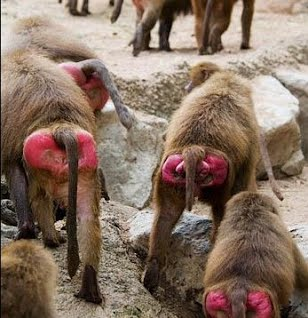

# Lab #8: BayesTraits  
## Evolutionary Inference with BayesTraits  

### Expected learning outcomes  
The objective of this activity is to help you understand how to conduct comparative analysis using Maximum Likelihood and Bayesian approaches. The exercises we will be doing today follow a tutorial provided by Mark Pagel and Andrew Meade in the BayesTraits manual. Additional exercises (using continuous characters) can be found at the AnthroTree [website](http://www.anthrotree.info/wiki/projects/pica/The_AnthroTree_Website.html).

### Introduction
[BayesTraits](http://www.evolution.rdg.ac.uk/BayesTraitsV3.0.1/BayesTraitsV3.0.1.html) is a computer package for performing analyses of trait evolution among groups of species for which a phylogeny or sample of phylogenies is available. It can be applied to the analysis of traits that adopt a finite number of discrete states, or to the analysis of continuously varying traits. Hypotheses can be tested about models of evolution, about ancestral states and about correlations among pairs of traits.

### Getting Started  
#### Software  

[BayesTraits](http://www.evolution.rdg.ac.uk/BayesTraitsV3.0.1/BayesTraitsV3.0.1.html) is available for Mac, Windows, and Linux. I also installed on the HPC-class (there is no module). You have to request resource allocation (_e.g.,_ `salloc -N 1 -n 4 -t 2:00:00`) before you use the program.

#### Datafiles
We will be using three datasets in this lab (all available in data directory on GitHub):  

* `Primates.trees`: sampled topologies from a Bayesian analysis, where all but the first 20 trees have been removed;  
* `MatingSystems.txt`: a file with a list of primate species and their mating systems. For purposes of this example primate mating systems were classified as "1": multimale (females mate with more than one male) or "0": unimale/monogamous.
* `Primates.txt`: same as `MatingSystems.txt`, except an additional column with presence/ absence of oestrous advertisement (sexual swellings) in female primates is added. 

### Tutorial  
Do exercises #1 and #2 from the [tutorial](https://sites.google.com/site/eeob563/computer-labs/lab-8).

### Good Luck!  

