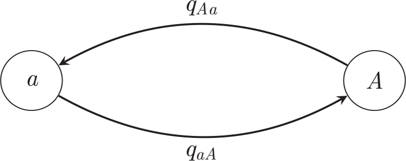

# Lab #8: BayesTraits  
## Evolutionary Inference with BayesTraits  


The objective of this activity is to help you understand how to conduct comparative analysis using Maximum Likelihood and Bayesian approaches. The exercises we will be doing today follow a tutorial provided by Mark Pagel and Andrew Meade in the BayesTraits manual. Additional exercises (using continuous characters) can be found at the AnthroTree [website](http://www.anthrotree.info/wiki/projects/pica/The_AnthroTree_Website.html).

## Introduction
[BayesTraits](http://www.evolution.rdg.ac.uk/BayesTraitsV3.0.2/BayesTraitsV3.0.2.html) is a computer package for performing analyses of trait evolution among groups of species for which a phylogeny or sample of phylogenies is available. It can be applied to the analysis of traits that adopt a finite number of discrete states, or to the analysis of continuously varying traits. Hypotheses can be tested about models of evolution, about ancestral states and about correlations among pairs of traits.

### Getting Started  
#### Software  

[BayesTraits](http://www.evolution.rdg.ac.uk/BayesTraitsV3.0.2/BayesTraitsV3.0.2.html) is available for Mac, Windows, and Linux. I also installed on the HPC-class (there is no module). You have to request resource allocation (_e.g.,_ `salloc -N 1 -n 4 -t 2:00:00`) before you use the program.

#### Datafiles
We will be using three datasets in this lab (all available in data directory on GitHub):  

* `Primates.trees`: sampled topologies from a Bayesian analysis, 
   where all but the first 20 trees have been removed;  
* `MatingSystems.txt`: a file with a list of primate species and 
   their mating systems. For purposes of this example primate mating 
   systems were classified as "1": multimale (females mate with 
   more than one male) or "0": unimale/monogamous.
* `Primates.txt`: same as `MatingSystems.txt`, except an additional column with presence/ absence of oestrous advertisement (sexual swellings) in female primates is added. 


# BayesTraits Tutorial

## Exercise 1: Using BayesTraits to estimate the model of evolution and ancestral states for a binary trait

This is an example showing how to calculate a likelihood and 
estimate the model of evolution using the data on primate 
mating systems reported in a study by Pagel and Meade 
(American Naturalist, 2006). For purposes of this example, 
consider that primate mating systems can be classified as 
multimale (females mate with more than one male) or 
unimale/monogamous. We assign a "1" to primates with a 
multimale mating system and a "0" otherwise. 

Then the model of evolution will be very simple with two 
states (0 and 1) and two rates (q_01 and q_10) for transitions 
between the two states:



The file MatingSystem.txt contains mating system data for a 
variety of primate species; primate phylogenetic trees are in Primates.trees 
(we use more than one to account for phylogenetic uncertainty).

### Using Maximum Likelihood.
#### Estimating the model

* Start by changing into the directory where the files are located (e.g., `cd ~/EEOB563-Spring2020/computer_labs/lab8`).
* Type `BayesTraits Primates.trees MatingSystems.txt` to start the program. 
* When prompted for the model of evolution, select MultiState by typing `1`. 
* When prompted for the analysis method, select Maximum Likelihood by typing `1`.
* Type `run` and the program returns the output shown below for each of the 20 
trees in the sample (here the output is shown for only the first 5 trees). 

``` 
Tree No Lh                 q01             q10             Root P(0)     Root P(1)
1         -26.128542     3.025913     1.855426     0.851787     0.148213

2         -25.680979     3.297484     2.040188     0.824616     0.175384

3         -25.423403     2.723676     0.370298     0.997926     0.002074

4         -23.943186     2.540747     1.358796     0.914664     0.085336

5         -25.266580     2.693710     1.121501     0.970575     0.029425
```
The output shows the tree number and its likelihood given the model, 
the values of the two rate coefficients and the reconstructed probabilities 
of the two states at the root of the tree. Note that in Likelihood, there is 
no natural way to combine these results across the trees.

> **Questions to consider:**  
> What is the overall direction of evolution in primate mating system?  
> What was the most likely mating system at the root of the tree?

> **Alternative way to run BayesTraits**
> Note, that instead of typing the options at the command prompt, you 
> can enter them in a control file, and then use input redirection to 
> use them for the analysis:
> `BayesTraits Primates.trees MatingSystems.txt < MatingSystemML.ctl`, 
> where you control file looks like:  
> 1  
> 1  
> run


#### Testing the model
To see if transitions to multimale mating systems occur at a higher rate than 
transitions to unimale or monogamy, fit a model in which the two rates are 
constrained to be the same. 

* Create this restriction by typing `restrict q01 q10` 
(you have to restart the program and follow the above instructions again)
* Check that the restrictions have been made by typing `info`
* Run the new model (`run`) and check the log-likelihood scores. A rule of thumb is that if this model is two or more log-likelihood units worse than the unconstrained model, then the two rate coefficients differ.

> **Questions to consider:**  
> How do you explain this "rule of thumb"?  
> Can we reject the hypothesis that the two rates are equal?

#### Reconstructing an ancestral state

BayesTraits has two approaches to reconstructing ancestral states. 
First, you can use the `Addnode` command. The `Addnode` command gives the 
program a list of species whose common ancestor is the node you wish 
to reconstruct. The program then finds the proportion of the likelihood 
associated with each of the possible states at the node. The node must 
exist in the tree for the command to work.

Alternatively, you can use the `AddMRCA` or Most Recent Common Ancestor. 
As with Addnode, you give a list of species whose ancestral state you wish 
to reconstruct. An MRCA reconstruction finds the node in each tree in the 
sample that minimally contains all of the species (tips) whose common ancestral 
state is of interest. In any given tree the MRCA might also include other species.

*  First, create a "Tag" with a species list: `AddTag GreatApes Pan_paniscus Pan_troglodytes Homo_sapiens Gorilla_gorilla Pongo_pygmaeus Pongo_pygmaeus_abelii` 
* Than, use `AddNode Node1 GreatApes` command to creates a dummy node Node01 
that here corresponds to the common ancestor to the Great Apes.
* Use `AddMRCA Node2 GreatApes` command to set up a reconstruction for a MRCA of a group of species.
* Type `info` to see the information about these nodes among the trees.  
To run the program type `run`

> **Questions to consider:**
> In how many trees Node01 was not present? In how many trees Node02 was not present? Why?
> What is the ML reconstruction for the type of the mating system in the common ancestor to the Great Apes?

#### Testing an ancestral state: Fossilizing a node

Internal nodes can be set to take a fixed value, if 
external information is available or to test if the value 
of one state is significant. The `fossil` command takes a 
name, so the node can be identified in the output, a tag 
that defines the node and the state or states to fossilise 
the node in. Fossilised nodes are found using the most 
recent common ancestor method. 


Let's test whether one type of a mating system is 
'significantly' more likely in the common ancestor of 
great apes.  First, use the `fossil Node1 GreatApes 0` 
command, which sets the Node1 to state 0 and run the 
analysis. Repeat the analysis but set Node1 to state 1 instead. 

> **Questions to consider:**  
> Do you find a significant difference in logL values? (as above, a difference of two log units (for one parameter) is conventionally taken as evidence for a 'significant' difference).
> What does it mean biologically?

## Using Markov Chain Monte Carlo.
We can perform the same analyses as above far more easily and 
consistently using MCMC methods. In addition to running a 
conventional Markov chain, BayesMultistate implements a 
reversible-jump MCMC method (see Pagel and Meade, Am. Nat., 2006) 
that automatically finds the posterior distribution of models 
of evolution for the data. For a binary trait the models are 
easy to enumerate: there can be two distinct rates, the two 
rates can be the same, or one or the other rate can be zero 
while the remaining one is positive. In the above example, 
we discovered that a model with one rate parameter 
was ____________________ than a model with two rate parameters. 
The RJ-MCMC model will discover this automatically, finding 
the models that best explain the data. The frequency of a 
given model in the posterior distribution of models is the posterior belief in that ‘hypothesis’.

### Estimating the model
Restart the program and choose  MultiState (option 1) and  MCMC (option 2).
At this stage you could run the model using conventional MCMC (try it, but 
first set the number of iterations to 1,000,000: "it 1000000")
You will see that the estimated rate coefficients (columns 5 and 6) are rather 
different from those under maximum likelihood (also the acceptance rate 
is too high). This situation arises because the uniform priors are not 
restrictive enough for the amount of data we have. We will use the "hyperprior" 
approach to deal with this problem (In Bayesian statistics, a hyperprior is a prior distribution on a hyperparameter, that is, on a parameter of a prior distribution).
Type `hpall exp 0 30` to specify an exponential prior seeded from a uniform on the interval 0 to 30.
Rerun the analysis

The column labelled "Harmonic Mean" (column #3) is the logarithm of the running harmonic mean of the likelihoods. It will be used for hypothesis testing (but remember the problem with the harmonic mean we discussed in class).
What is the harmonic mean for current model? What is the model?
Finally, we will run Reverse Jump MCMC for model selection: (repeat all the commands above + type "rjhp exp 0 30")
Run the program and check the output. Notice that new columns appeared: #5 ("No off parameters" sic.) and #7 ("Model")
How many parameters are in the selected model? What does it mean in terms of rates of change? 
Reconstructing an ancestral state

Start the program and select MultiState and MCMC from the options.
Use "AddMRCA Node-H GreatApes" command to add a node H to be reconstructed (specifying the common ancestor of the Great Apes).
Use "ratedev 8" and "rjhp exp 0 30" to select a deviation of the normal distribution value and to specify a hyperprior
Type "info" to see that the node has been accepted. 
Type "run" to run the analysis
To test whether there is support for one state over the other at that node use the fossil command in place of the AddMRCA ("fossil node1 GreatApes 0").
Run the analysis for at least several millions of iterations and note the harmonic mean.
Repeat this run using "fossil node1 GreatApes 1"
Use stepping stone sampling to estimate the marginal likelihood of the model: "Stones 100 100000" . 
The sampler runs after the chain has finished and produces a file with the extension “Stones.txt”, the log marginal likelihood is recorded on the last line of the file. 
The Bayes Factor test is just twice the difference between these two numbers.
What was your Bayes Factor and what does it tell us?
exercise 2: Using BayesTraits to test for corr


### Good Luck!  

